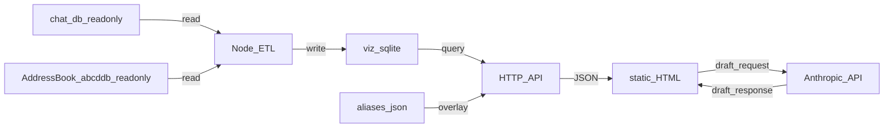

# Messages Visualizer

A local-only intelligence platform for your Apple Messages history. Explore who you communicate with, how your relationships evolve over time, and draft context-aware replies — all without your data ever leaving your machine.

The original `chat.db` is **never modified**. A derived SQLite file (`viz.sqlite`) is built separately and powers all charts, queries, and the AI drafting assistant.

---

## What it does

**Dashboard** — aggregate statistics across your full message history: top contacts by volume, sent/received ratios, active chats, date range, and total OTP and promotional messages received.

**Authentication Stats** — timeline of one-time passwords and security codes, with a ranked breakdown of which services send the most.

**Promo Stats** — promotional and marketing messages over time, categorized by sender.

**Tone** — monthly AFINN sentiment analysis split by direction (you wrote vs. they wrote), plus a per-contact tone table showing warmth deltas across your top 50 relationships.

**Drafter** — a dedicated AI drafting assistant. Select any contact, load their conversation context, configure an agent persona and tone, and generate a reply. Drafts are saved locally per contact. Powered by the Anthropic API; no message content is sent anywhere else.

---

## Architecture

- **ETL** — Node script reads `chat.db` and your AddressBook (both read-only) and writes a derived file at `data/viz.sqlite`.
- **HTTP API** — Local Node server serves JSON from `viz.sqlite` only. Exposes both aggregate endpoints (used by the dashboard) and per-contact message endpoints (used by the Drafter).
- **Frontend** — Static HTML and JavaScript in `public/`. No build step.

The only outbound network call is from the Drafter to `api.anthropic.com`. Message content sent in that request is governed by Anthropic's API privacy policy. All other processing is local.

---

## Privacy and data paths

All defaults assume the standard macOS layout. On a stock Mac, `npm run import` works with no environment variables set.

- `data/` and all database files are gitignored. Originals and derived copies are never committed accidentally.
- **`CHAT_DB_PATH`** — path to `chat.db`. Defaults to `~/Library/Messages/chat.db`. Read-only.
- **`ADDRESSBOOK_ROOT`** — directory containing AddressBook `.abcddb` files. Defaults to `~/Library/Application Support/AddressBook`. Read-only. Used to populate contact names; the import continues without it if unreadable.
- **`VIZ_DB_PATH`** — where the derived database is written. Defaults to `./data/viz.sqlite`.
- **`ALIASES_PATH`** — user-edited contact aliases. Defaults to `./data/aliases.json`. Survives re-imports.
- **`PORT`** — server listen port. Defaults to `3000`.

---

## Permissions

The import script reads two paths inside `~/Library`. macOS protects these from terminal apps by default. Before the first `npm run import`, grant **Full Disk Access** to your terminal:

System Settings → Privacy & Security → Full Disk Access → add Terminal (or iTerm2, VS Code, etc.) → toggle on → quit and relaunch.

If you skip this, the importer still runs but contact names won't autopopulate.

---

## How to run

Requires **Node.js 18+** (uses the built-in `node:sqlite` module — no native dependencies, no `npm install` needed).

1. Grant Full Disk Access to your terminal (see above).
2. `npm run import` — builds `data/viz.sqlite` from `chat.db` and AddressBook.
3. `npm start` — starts the local server at `http://localhost:3000` (override with `PORT=3001 npm start`).
4. Open the URL in your browser.

After pulling a newer version of this project, run `npm run import` again to rebuild `viz.sqlite` with any new tables or columns. Your aliases (`data/aliases.json`) are preserved.

---

## API routes

| Method | Route | Description |
|--------|-------|-------------|
| `GET` | `/api/contacts` | Top contacts ranked by message volume |
| `GET` | `/api/messages?handle=:handle&limit=:n` | Per-contact message thread (used by Drafter) |
| `GET` | `/api/messages?chat_id=:id&limit=:n` | Per-group-chat message thread (used by Drafter) |
| `GET` | `/api/stats` | Aggregate dashboard stats |
| `GET` | `/api/tone` | Sentiment data by contact and month |
| `GET` | `/api/auth` | OTP and authentication message data |
| `GET` | `/api/promo` | Promotional message data |

---

## Pages

| File | Description |
|------|-------------|
| `public/index.html` | Main dashboard |
| `public/auth.html` | Authentication stats |
| `public/promo.html` | Promotional message stats |
| `public/tone.html` | Sentiment and tone analysis |
| `public/drafter.html` | AI-powered reply drafter |

---

## Schema overview

The ETL reads from these core Apple Messages tables:

| Table | Purpose |
|-------|---------|
| `message` | Core message records |
| `chat` | Conversation threads |
| `handle` | Contacts / phone numbers / Apple IDs |
| `attachment` | Attachment metadata |
| `chat_message_join` | Maps messages to threads |
| `message_attachment_join` | Maps messages to attachments |
| `chat_handle_join` | Maps contacts to chats |
| `deleted_messages` | Deleted/recoverable message metadata |
| `recoverable_message_part` | Partial recovery artifacts |
