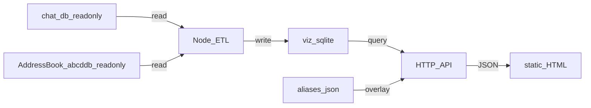

# Messages visualization

This repository includes a **local-only** web UI for exploring aggregated statistics from an exported macOS Apple Messages database. The original `chat.db` file is **never modified** by this project; a separate derived SQLite file is built for charts and API queries.

## Project intent

- Keep processing on your machine; do not commit or upload `chat.db` or derived databases unless you intend to.
- Import **read-only** snapshots from `chat.db` into a derived SQLite database used only by the local server and browser UI.

## Architecture

- **ETL** — Node script reads `chat.db` (read-only) and writes a derived file at `data/viz.sqlite` by default (override with `VIZ_DB_PATH`).
- **HTTP API** — Local Node server serves JSON from the derived database only.
- **Frontend** — Static HTML and JavaScript in `public/`.

## Privacy and data paths

All defaults assume the standard macOS layout, so on a stock Mac you should be able to run `npm run import` with no environment variables set. Override only if your data lives elsewhere.

- `data/` and database files are gitignored so originals and derived copies are never committed accidentally.
- **`CHAT_DB_PATH`** — absolute path to your Messages `chat.db`. Defaults to `~/Library/Messages/chat.db`. Read-only.
- **`ADDRESSBOOK_ROOT`** — directory containing AddressBook `.abcddb` files (one top-level db plus one per source). Defaults to `~/Library/Application Support/AddressBook`. Read-only. Used to autopopulate contact names; if unreadable, the import continues without names and the UI shows raw phone/email identifiers.
- **`VIZ_DB_PATH`** — where the derived database is written. Defaults to `./data/viz.sqlite`.
- **`ALIASES_PATH`** — where user-edited contact aliases are stored. Defaults to `./data/aliases.json`. Survives re-imports.
- **`PORT`** — server listen port. Defaults to `3000`.

## Permissions

The import script reads two paths inside `~/Library`. macOS protects these from terminal apps by default, so before the first `npm run import` you need to grant **Full Disk Access** to whichever terminal/IDE you'll run the command from:

System Settings → Privacy & Security → Full Disk Access → add Terminal (or iTerm2, VS Code, etc.) and toggle it on. Quit and relaunch the terminal so the new permission takes effect.

If you skip this, the importer still runs but contact names won't autopopulate.

## How to run (local)

Requires **Node.js 18+** (uses the built-in `node:sqlite` module — no native dependencies, no `npm install` step needed).

1. Grant Full Disk Access to your terminal (see above).
2. `npm run import` — builds `data/viz.sqlite` from your live `chat.db` and AddressBook.
3. `npm start` — starts the local server (default `http://localhost:3000`; override with `PORT=3001 npm start`).
4. Open the URL in your browser.

If you pull a newer version of this project, run `npm run import` again so `viz.sqlite` is rebuilt with any new tables or columns. Your aliases (`data/aliases.json`) are preserved across re-imports.

---

## Initial Analysis of Apple Messages `chat.db`

### Dataset Overview

The uploaded SQLite database appears to be a valid macOS Apple Messages database.

### High-Level Statistics

| Metric                   |                 Value |
| ------------------------ | --------------------: |
| Total Messages           |                26,850 |
| Total Chats / Threads    |                 1,188 |
| Total Handles / Contacts |                 1,696 |
| Total Attachments        |                 1,543 |
| Database Type            | Apple Messages SQLite |

The database contains both modern and recoverable/deleted-message infrastructure tables, suggesting a relatively recent macOS schema.

---

## Detected Core Tables

The database contains the expected Apple Messages relational structure.

## Important Tables

| Table                      | Purpose                              |
| -------------------------- | ------------------------------------ |
| `message`                  | Core message records                 |
| `chat`                     | Conversation threads                 |
| `handle`                   | Contacts / phone numbers / Apple IDs |
| `attachment`               | Attachment metadata                  |
| `chat_message_join`        | Maps messages to threads             |
| `message_attachment_join`  | Maps messages to attachments         |
| `chat_handle_join`         | Maps contacts to chats               |
| `deleted_messages`         | Deleted/recoverable message metadata |
| `recoverable_message_part` | Partial recovery artifacts           |

This is a strong foundation for longitudinal behavioral analysis.

---

## Immediate Observations

## 1. Relationship Concentration

The dataset is highly non-uniform.

A very small number of contacts account for a disproportionately large percentage of total communication volume.

Preliminary analysis indicates:

* one dominant contact exceeds 5,000 messages
* several secondary contacts range between 2,000–700 messag
* the majority of handles appear sparse or transactional

This usually indicates:

* a small emotional/social core network
* high-recency or high-intensity interpersonal anchors
* long-tail low-frequency contacts

---

## 2. Strong Asymmetry Patterns

Several high-volume threads appear heavily one-directional.

Examples observed:

* some contacts send hundreds of messages with few or no replies recorded
* one major thread contains thousands of inbound messages with relatively few outbound responses

Possible interpretations:

* broadcast/group systems
* ministry/community coordination
* business notifications
* emotionally asymmetric relationships
* archived or partially synced histories

This is analytically important because reciprocity often correlates strongly with relationship quality and conversational sustainability.

---

## 3. Attachment Usage

The database contains over 1,500 attachment records.

This enables:

* media exchange analysis
* image-heavy relationship detection
* emotional-density estimation
* document-sharing behavior analysis
* meme/media culture mapping

Potential classification categories:

* screenshots
* PDFs
* photos
* links
* videos
* audio messages

---

## 4. Recoverable / Deleted Data Structures

The presence of:

* `deleted_messages`
* `recoverable_message_part`
* `chat_recoverable_message_join`

…suggests the schema supports some level of recoverable-message persistence.

Depding on:

* SQLite vacuum history
* iCloud sync behavior
* local cleanup
* schema generation

…partial deleted-message reconstruction may be possible.

---

## 5. Communication Infrastructure Characteristics

The schema includes:

* scheduled messaging structures
* oudKit synchronization tables
* task persistence systems
* lookup acceleration tables

This indicates:

* modern Apple Messages synchronization architecture
* likely iCloud-backed messaging
* metadata-rich interaction history

---

## High-Value Analytics Available Next

## Relationship Intelligence

We can derive:

* strongest relationships
* fading relationships
* dormant relationships
* reciprocity scoring
* initiation ratios
* emotional density estimates
* conversational persistence

---

## Temporal Analysis

We can generate:

* hourly communication heatmaps
* weekly rhythm charts
* sleep-disruption indicators
* stress-period communication collapse
* seasonal social behavior
* academic/work-cycle correlations

---

## Response-Time Analytics

We can compute:

* average response latency
* median response latency
* ignored-message frequency
* conversational momentum
* rapid-response contacts
* delayed-response contacts

This becomes especially valuable when segmented by relationship.

---

## Linguistic / NLP Analysis

Once message text is processed, we can analyze:

* sentiment drift
* emotional volatility
* reassurance-seeking patterns
* conflict markers
* supportiveness
* emotional exhaustion indicators
* conversational tone evolution

Potential outputs:

* emotional timelines
* relationship health indicators
* topic clustering
* semantic retrieval systems

---

## Network Graph Possibilities

This dataset is sufficient to construct:

* social graphs
* communication clusters
* support-network maps
* interpersonal centrality models
* interaction-density diagrams

Visualization candidates:

* force-directed graphs
* Sankey flows
* temporal network evolution
* weighted interaction matrices

---

## Personalized Drafting System Potential

One of the highest-value long-term applications is contact-specific drafting assistance.

The database contains enough signal to infer:

* preferred tone
* response cadence
* sentence-length norms
* emotional directness
* emoji frequency
* humor usage
* formality level
* conversational pacing

This could power:

* context-aware draft suggestions
* tone matching
* conflict-sensitive phrasing
* communication optimization

---

## Suggested Phase-Based Roadmap

## Phase 1 — Structural Extraction

Goal:

* normalize messages
* decode timestamps
* map chats ↔ handles
* export clean datasets

Outputs:

* CSV
* JSON
* normalized relational model

---

## Phase 2 — Behavioral Analytics

Goal:

* response latency
* reciprocity
* activity heatmaps
* relationship ranking

Outputs:

* dashboards
* timelinestistical summaries

---

## Phase 3 — NLP Layer

Goal:

* embeddings
* topic modeling
* sentiment analysis
* semantic search

Outputs:

* emotional trend reports
* semantic retrieval engine
* AI-assisted summarization

---

## Phase 4 — Visualization Ecosystem

Goal:

* interactive graphs
* relaship explorer
* timeline playback
* communication observability

Potential stack:

* SQLite
* DuckDB
* Python/Pandas
* NetworkX
* Neo4j
* React
* D3.js
* local LLM inference

---

## Most Valuable Immediate Next Steps

For a deeper second-pass analysis, the highest-value operations are likely:

1. Full timestamp normalization
2. Top-contact behavioral ranking
3. Reciprocity scoring
4. Response-time modeling
5. Hour/day communication heatmaps
6. Attachment categorization
7. Conversation-length distributions
8. NLP sentiment extraction
9. Longitudinal emotional analysis
10. Relationship stability scoring

---

## Important Privacy Note

This dataset is extremely sensitive.

A mature analysis ecosystem should strongly prefer:

* local-only processing
* encrypted storage
* selective redaction
* attachment sandboxing
* access segmentation
* export auditing

The uploaded database is rich enough to support meaningful behavioral inference, interpersonal analysis, and highly personalized AI-assisted communication tooling.

