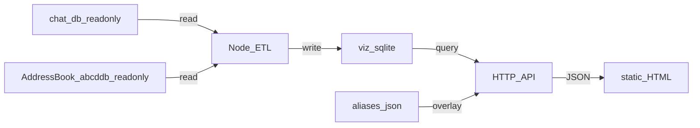

# Messages visualization

This repository includes a **local-only** web UI for exploring aggregated statistics from an exported macOS Apple Messages database. The original `chat.db` file is **never modified** by this project; a separate derived SQLite file is built for charts and API queries.

## Project intent

- Keep processing on your machine; do not commit or upload `chat.db` or derived databases unless you intend to.
- Import **read-only** snapshots from `chat.db` into a derived SQLite database used only by the local server and browser UI.

## Architecture

- **ETL** — Node script reads `chat.db` (read-only) and writes a derived file at `data/viz.sqlite` by default (override with `VIZ_DB_PATH`).
- **HTTP API** — Local Node server serves JSON from the derived database only.
- **Frontend** — Static HTML and JavaScript in `public/`.

## Privacy and data paths

All defaults assume the standard macOS layout, so on a stock Mac you should be able to run `npm run import` with no environment variables set. Override only if your data lives elsewhere.

- `data/` and database files are gitignored so originals and derived copies are never committed accidentally.
- **`CHAT_DB_PATH`** — absolute path to your Messages `chat.db`. Defaults to `~/Library/Messages/chat.db`. Read-only.
- **`ADDRESSBOOK_ROOT`** — directory containing AddressBook `.abcddb` files (one top-level db plus one per source). Defaults to `~/Library/Application Support/AddressBook`. Read-only. Used to autopopulate contact names; if unreadable, the import continues without names and the UI shows raw phone/email identifiers.
- **`VIZ_DB_PATH`** — where the derived database is written. Defaults to `./data/viz.sqlite`.
- **`ALIASES_PATH`** — where user-edited contact aliases are stored. Defaults to `./data/aliases.json`. Survives re-imports.
- **`PORT`** — server listen port. Defaults to `3000`.

## Permissions

The import script reads two paths inside `~/Library`. macOS protects these from terminal apps by default, so before the first `npm run import` you need to grant **Full Disk Access** to whichever terminal/IDE you'll run the command from:

System Settings → Privacy & Security → Full Disk Access → add Terminal (or iTerm2, VS Code, etc.) and toggle it on. Quit and relaunch the terminal so the new permission takes effect.

If you skip this, the importer still runs but contact names won't autopopulate.

## How to run (local)

Requires **Node.js 18+** (uses the built-in `node:sqlite` module — no native dependencies, no `npm install` step needed).

1. Grant Full Disk Access to your terminal (see above).
2. `npm run import` — builds `data/viz.sqlite` from your live `chat.db` and AddressBook.
3. `npm start` — starts the local server (default `http://localhost:3000`; override with `PORT=3001 npm start`).
4. Open the URL in your browser.

If you pull a newer version of this project, run `npm run import` again so `viz.sqlite` is rebuilt with any new tables or columns. Your aliases (`data/aliases.json`) are preserved across re-imports.

---

## Initial Analysis of Apple Messages `chat.db`

### Dataset Overview

The uploaded SQLite database appears to be a valid macOS Apple Messages database.

### High-Level Statistics

| Metric                   |                 Value |
| ------------------------ | --------------------: |
| Total Messages           |                26,850 |
| Total Chats / Threads    |                 1,188 |
| Total Handles / Contacts |                 1,696 |
| Total Attachments        |                 1,543 |
| Database Type            | Apple Messages SQLite |

The database contains both modern and recoverable/deleted-message infrastructure tables, suggesting a relatively recent macOS schema.

---

## Detected Core Tables

The database contains the expected Apple Messages relational structure.

## Important Tables

| Table                      | Purpose                              |
| -------------------------- | ------------------------------------ |
| `message`                  | Core message records                 |
| `chat`                     | Conversation threads                 |
| `handle`                   | Contacts / phone numbers / Apple IDs |
| `attachment`               | Attachment metadata                  |
| `chat_message_join`        | Maps messages to threads             |
| `message_attachment_join`  | Maps messages to attachments         |
| `chat_handle_join`         | Maps contacts to chats               |
| `deleted_messages`         | Deleted/recoverable message metadata |
| `recoverable_message_part` | Partial recovery artifacts           |

This is a strong foundation for longitudinal behavioral analysis.

---

